<div align="center">

&nbsp;
&nbsp;
&nbsp;
&nbsp;
&nbsp;

&nbsp;&nbsp;
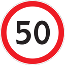&nbsp;
&nbsp;
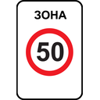
&nbsp;&nbsp;
&nbsp;

&nbsp;&nbsp;
&nbsp;
&nbsp;
&nbsp;
&nbsp;


# TrafficSignBench

**Your planner scores 90.0. It just drove through an occupied crosswalk.**

A closed-loop benchmark that turns *every* traffic sign into an executable test
with an automatic rule checker — on real road geometry.

<p>
<a href="https://arxiv.org/abs/TODO"></a>
<a href="https://emb-ai.github.io/traffic-sign-bench/"></a>
<a href="https://huggingface.co/datasets/emb-ai/traffic-sign-bench"></a>
<a href="https://huggingface.co/emb-ai/traffic-rule-bench-models"></a>
<a href="https://github.com/emb-ai/traffic-sign-bench/stargazers"></a>
</p>

<table>
<tr>
<td align="center"><b>34</b><br><sub>traffic signs<br>with rule checkers</sub></td>
<td align="center"><b>29</b><br><sub>closed-loop<br>scenario types</sub></td>
<td align="center"><b>26,020</b><br><sub>real-map crops<br>from OpenStreetMap</sub></td>
<td align="center"><b>29,000</b><br><sub>scenarios<br>23.2k train / 5.8k test</sub></td>
<td align="center"><b>17</b><br><sub>planners<br>evaluated</sub></td>
</tr>
</table>


</div>

---

## Contents

[Why](#why-another-benchmark) · [Results](#results) · [See it](#see-it-planner-vs-rule-supervised-planner) · [What's inside](#whats-inside) ·
[Quick start](#quick-start-10-minutes) · [Evaluation](#evaluation) · [Planners](#planners-and-checkpoints) ·
[Fine-tuning](#rule-supervised-fine-tuning) · [Signs](#sign-registry) · [Repo map](#repository-map) · [Cite](#citation)

## Why another benchmark?

Driving Score, Destination Rate, Efficiency, Collision Rate — a planner can top all
four and still be illegal. Below, a state-of-the-art planner scores 90.0 DS with a
0% collision rate while driving straight through an occupied pedestrian crossing.
Nothing in the conventional metric set notices.

<p align="center">
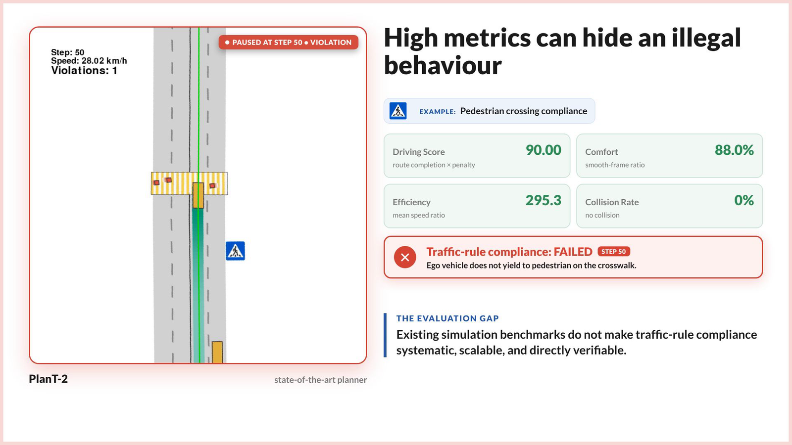
</p>

TrafficSignBench closes that gap. Every sign becomes an **explicit test**: a scenario
built to force the decision, plus a **deterministic rule checker** evaluated at every
simulation step. The headline metric is **SCD — Sign Compliance × Destination**: the
ego must obey the active sign *and* still reach its goal. Obeying by getting stuck
does not count.

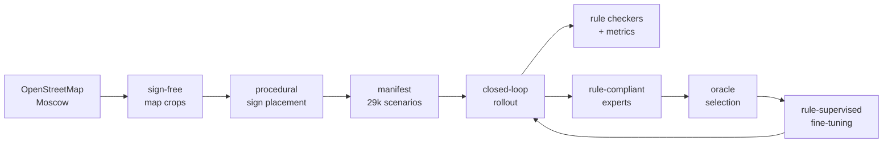

## Results

Standard planners reach **2.9–9.0% overall SCD** across the 29 scenario types. Same scene,
same seed, four different planners — four different ways to be illegal.

<p align="center">
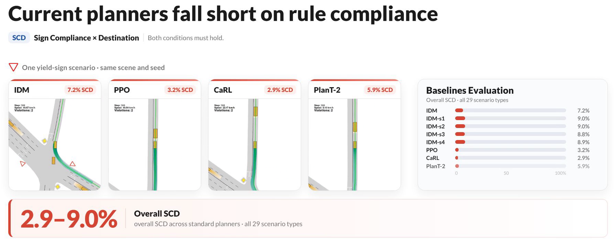
</p>

Rule-supervised fine-tuning moves PlanT-2 from **5.9% to 72.3%** without touching the
backbone: signs become object tokens plus a persistent sign-state token, adding 0.4% new
parameters.

<p align="center">
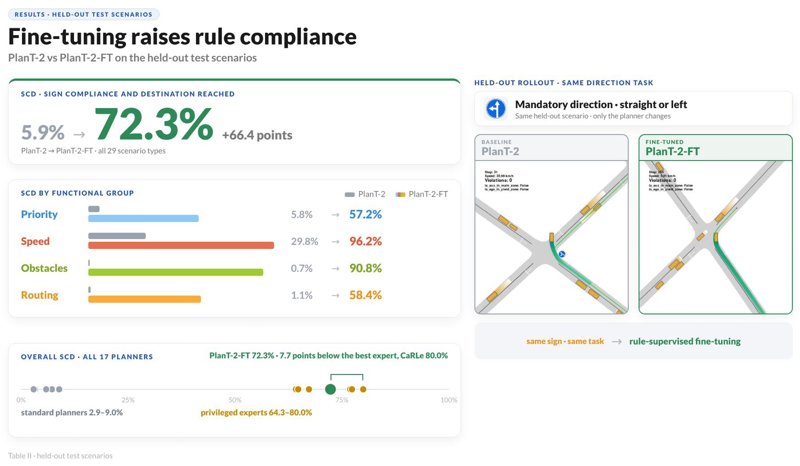
</p>

<table>
<thead>
<tr><th align="left">Planner</th><th>DS ↑</th><th>Dest. % ↑</th><th>Coll. % ↓</th><th>Priority ↑</th><th>Speed ↑</th><th>Obstacles ↑</th><th>Routing ↑</th><th>Overall SCD ↑</th></tr>
</thead>
<tbody>
<tr><td>IDM</td><td align="center">35.7</td><td align="center">66.4</td><td align="center">21.0</td><td align="center">14.6</td><td align="center">26.6</td><td align="center">1.7</td><td align="center">0.0</td><td align="center">7.2</td></tr>
<tr><td>PPO</td><td align="center">35.6</td><td align="center">67.9</td><td align="center">27.5</td><td align="center">3.0</td><td align="center">17.0</td><td align="center">0.9</td><td align="center">0.0</td><td align="center">3.2</td></tr>
<tr><td>CaRL</td><td align="center">39.6</td><td align="center">73.7</td><td align="center">21.0</td><td align="center">2.0</td><td align="center">10.2</td><td align="center">3.7</td><td align="center">0.1</td><td align="center">2.9</td></tr>
<tr><td>PlanT-2</td><td align="center">28.6</td><td align="center">56.1</td><td align="center">43.3</td><td align="center">5.8</td><td align="center">29.8</td><td align="center">0.7</td><td align="center">1.1</td><td align="center">5.9</td></tr>
<tr><td><b>PlanT-2-FT</b></td><td align="center"><b>74.2</b></td><td align="center"><b>74.8</b></td><td align="center"><b>12.0</b></td><td align="center"><b>57.2</b></td><td align="center"><b>96.2</b></td><td align="center"><b>90.8</b></td><td align="center"><b>58.4</b></td><td align="center"><b>72.3</b></td></tr>
<tr><td><sub><i>CaRL<sup>e</sup> — privileged reference</i></sub></td><td align="center"><sub>80.9</sub></td><td align="center"><sub>81.3</sub></td><td align="center"><sub>13.0</sub></td><td align="center"><sub>80.6</sub></td><td align="center"><sub>95.2</sub></td><td align="center"><sub>87.9</sub></td><td align="center"><sub>68.5</sub></td><td align="center"><sub>80.0</sub></td></tr>
</tbody>
</table>

<sub>Held-out test split, 5,800 episodes. Conventional metrics are episode-weighted; SCD is
macro-averaged over scenario types so every rule carries equal weight. Privileged policies
read the target rule directly and are reported as an upper reference, not as baselines.
Full 17-planner table, confidence intervals, and the sign-channel ablation are in the paper.</sub>

Two findings worth the click:

- **No conventional metric is a proxy.** Spearman ρ against overall SCD is −0.20 for
  Driving Score and −0.23 for Destination Rate, and the sign flips per rule category.
  Collision Rate is the closest (ρ = −0.93) yet is uncorrelated with Routing (+0.07).
- **The gains are genuinely sign-conditioned.** Strip sign identity from the tokens and
  replay the same checkpoint on the same scenes: SCD collapses 72.8% → 15.4%.

## See it: planner vs. rule-supervised planner

Same scene, same seed, same route — only the planner changes. The overlay counts
violations live.

<table>
<tr>
<th width="12%">Rule</th>
<th width="44%">PlanT-2 <sub>baseline</sub></th>
<th width="44%">PlanT-2-FT <sub>rule-supervised</sub></th>
</tr>
<tr>
<td align="center"><br><b>Stop</b><br><sub>2.5</sub></td>
<td align="center">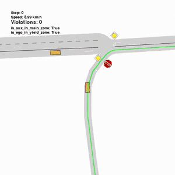<br><sub>never comes to a stop</sub></td>
<td align="center">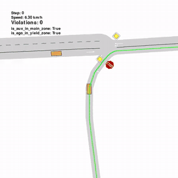<br><sub>full stop, then proceeds</sub></td>
</tr>
<tr>
<td align="center"><br><b>Pass right</b><br><sub>4.2.1</sub></td>
<td align="center">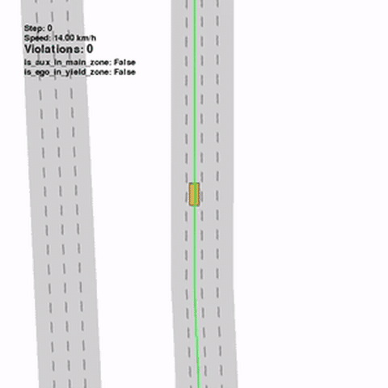<br><sub>wrong side of the obstacle</sub></td>
<td align="center">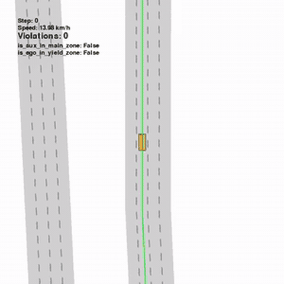<br><sub>prescribed side, route kept</sub></td>
</tr>
<tr>
<td align="center"><br><b>Zone limit</b><br><sub>5.31</sub></td>
<td align="center">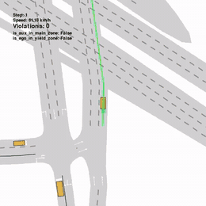<br><sub>speeds through the zone</sub></td>
<td align="center">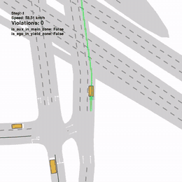<br><sub>holds the posted limit</sub></td>
</tr>
<tr>
<td align="center"><br><b>Left or right</b><br><sub>4.1.6</sub></td>
<td align="center">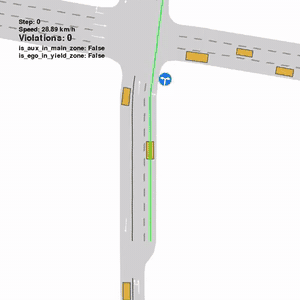<br><sub>takes the prohibited branch</sub></td>
<td align="center">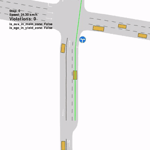<br><sub>reroutes, accepts the detour</sub></td>
</tr>
</table>

> On dual-path maps the destination is chosen so that the **prohibited branch is the
> shortest path**. Rule compliance has to be worth more to the planner than efficiency.

## What's inside

### 34 signs → 4 semantic groups

Signs are grouped by the capability they demand of the ego vehicle, so a failure points at
a behaviour rather than at a pictogram.

<p align="center">
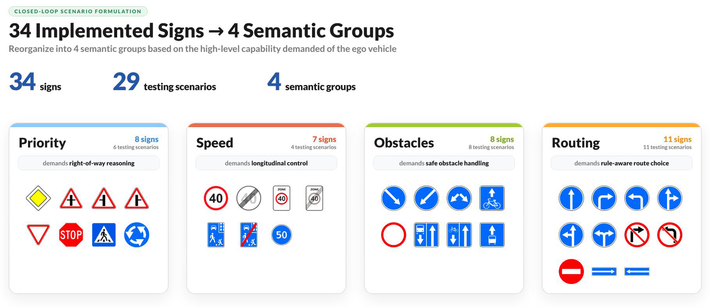
</p>

| Group | Types | What it probes |
| --- | --- | --- |
| **Priority** | 6 | right-of-way against conflicting agents at unsignalized junctions, roundabouts, crossings |
| **Speed** | 4 | longitudinal control under maximum, minimum, and area-wide limits |
| **Obstacles** | 8 | navigating inaccessible space — detours, blocked roads, reserved lanes |
| **Routing** | 11 | avoiding prohibited segments and manoeuvres, re-planning under restrictions |

### Real road geometry, not a generator you can overfit

Scenes are harvested as **sign-free** lane-level fragments from Moscow OpenStreetMap data,
then signs are placed procedurally where their semantics allow. Each sign gets 100 maps,
split 80/20 **before** assignment by OSM ID, so no street appears in both train and test.

<p align="center">
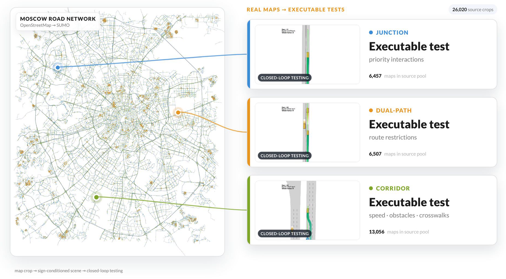
</p>

<table>
<tr>
<td align="center" width="33%">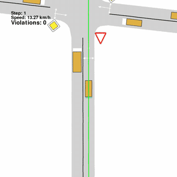<br><b>Junctions</b><br><sub>6,457 T / X / roundabout<br>→ Priority</sub></td>
<td align="center" width="33%">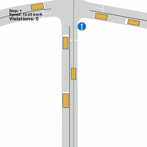<br><b>Dual-path</b><br><sub>6,507 maps<br>→ Routing</sub></td>
<td align="center" width="33%">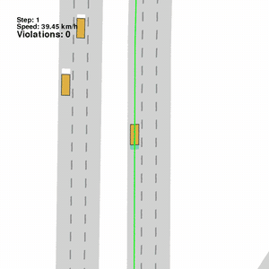<br><b>Corridors</b><br><sub>13,056 maps<br>→ Speed · Obstacles · Crosswalk</sub></td>
</tr>
</table>

Each map is expanded into **10 scenarios** varying ego spawn lane, route length, initial
speed, traffic density, and background-agent dynamics — all sampled from distributions
fitted to **nuPlan**, so "dense" and "fast" mean something measured rather than chosen.

<details>
<summary><b>The five expansion axes, and where their distributions come from</b></summary>
<br>
<p align="center">
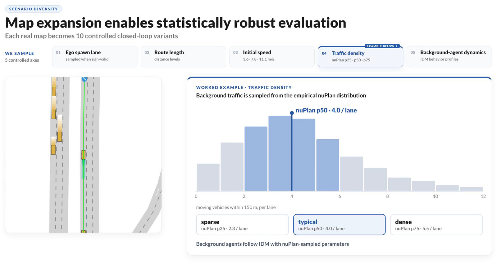
</p>

Density and initial speed are drawn from a small set of nuPlan quantiles rather than a
continuous range, so each semantic group can be probed under sparse/dense and slow/fast
conditions and the results stay comparable across signs. Background agents run IDM.
Scenario augmentation is configured per sign under `augmentation.layout` and
`augmentation.auxiliary` — see the [evaluation guide](traffic_bench/eval/README.md).
</details>

### Portable beyond one traffic code

The rule logic is separated from the sign artwork. Across Vienna Convention signatories the
34 implemented signs have a semantic equivalent **92% of the time on average**, so adapting
to another jurisdiction is mostly a matter of swapping pictograms.

<p align="center">
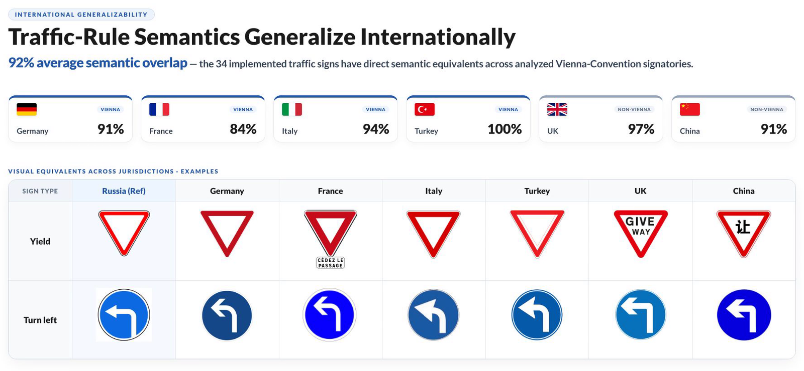
</p>

<details>
<summary><b>Where the 34 signs sit in the international taxonomy</b></summary>
<br>
<p align="center">
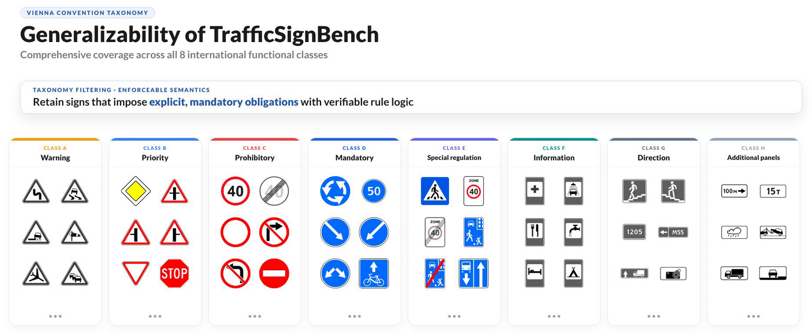
</p>

We keep signs that impose an explicit, mandatory, verifiable rule, and drop warning and
informational plates whose meaning is contextual or conditional. The remaining set is
cross-referenced against the Moscow traffic-sign database, so nothing unobserved in practice
is included.
</details>

## Quick start (10 minutes)

Linux, Python 3.10. The walkthrough below runs one IDM episode on yield-sign scenes and
writes a GIF — no GPU, no checkpoints.

### 1 · Install

```bash
git clone --recurse-submodules https://github.com/emb-ai/traffic-sign-bench.git
cd traffic-sign-bench

conda create -n trafficsignbench python=3.10 -y
conda activate trafficsignbench

pip install -e third_party/metadrive     # patched MetaDrive with sign objects
pip install -e .
pip install eclipse-sumo sumolib hydra-core scipy pandas \
            stable-baselines3 pyproj "geopandas<1.0" timm huggingface_hub
```

<details>
<summary>Cloned without <code>--recurse-submodules</code>, or something failed</summary>
<br>

| Symptom | Fix |
| --- | --- |
| `third_party/metadrive` is empty | `git submodule update --init --recursive` |
| `SUMO_HOME` / `netconvert` not found | `eclipse-sumo` ships the binaries; make sure the env is active |
| `hf: command not found` | needs `huggingface_hub >= 0.34`; on older versions use `huggingface-cli download` |
| ALSA / audio spam on a headless node | harmless — the CLI already sets `SDL_AUDIODRIVER=dummy` |
| GIF rendering fails | Panda3D needs an offscreen GL context; drop `gif.enabled=true` to skip rendering |

The three submodules are [emb-ai/metadrive](https://github.com/emb-ai/metadrive) (simulator
with sign objects and rule zones), [emb-ai/plant2](https://github.com/emb-ai/plant2), and
[autonomousvision/CaRL](https://github.com/autonomousvision/CaRL).
</details>

### 2 · Download scenes

```bash
hf download emb-ai/traffic-sign-bench --repo-type dataset \
  --include "scenes/yield/**" --local-dir data
```

Scenes land in `data/scenes/<sign>/`. Drop `--include` to fetch all 29 scene folders.

### 3 · Run one test

```bash
# scenes + config → a reproducible list of scenarios
python -m traffic_bench.eval manifest sign=yield scenario.max_total=1

# closed-loop rollout with rule checking, plus a GIF
python -m traffic_bench.eval run policy=idm sign=yield jobs=1 gif.enabled=true
```

Everything lands in `data/runs/yield/debug/<timestamp>/` — episode records, per-episode
metrics, a markdown report, and `gifs/`. Open the GIF: the overlay shows the active rule
zone and the running violation count.

## Evaluation

Three verbs, always in this order:

```bash
# 1 — freeze a test manifest (one sign per invocation)
python -m traffic_bench.eval manifest sign=yield paths.split=test

# 2 — evaluate one planner, several, or all of them
python -m traffic_bench.eval run policies=[idm,idm_rule,plant2_ft] sign=yield

# 3 — pool finished runs into one report
python -m traffic_bench.eval metrics combine sign=all
```

`sign=all` covers the benchmark, `policies=all` covers every registered planner, and nested
sign IDs use paths like `direction/right` or `detour/left`.

**Splits.** `paths.split=debug` (default) writes a timestamped throwaway snapshot;
`train` and `test` write immutable snapshots you must delete before rebuilding.

**Metrics.** Every episode reports the primary `target_compliant_event` (did the ego obey the
active sign inside its zone), destination success, route completion, every violation the
checkers fired, and nuPlan-style comfort. `SCD` is the conjunction of sign compliance and
destination, macro-averaged over scenario types.

**Scale.** On a multi-GPU node, one process pool handles CPU planners while each GPU takes a
sign:

```bash
SPLIT=test CPU_WORKERS=4 GPUS=1,2,3,4,5,6,7 JOBS=16 JOBS_NN=16 \
  bash traffic_bench/eval/run/run_signs_parallel.sh

python tools/eval_progress.py --watch 30     # progress + ETA
```

> **Read this before you Ctrl+C a parallel run.** CPU eval uses `ProcessPoolExecutor` with
> `spawn`; killing the parent orphans workers that keep holding RAM. The
> [evaluation guide](traffic_bench/eval/README.md) has the exact cleanup commands.

Full CLI reference, Hydra override catalogue, augmentation axes, and per-family scenario
logic: **[`traffic_bench/eval/README.md`](traffic_bench/eval/README.md)**.

## Planners and checkpoints

| `policy=` | Backbone | Rule access | Checkpoint |
| --- | --- | --- | --- |
| `idm` | CurveAwareIDM | — | none |
| `idm_rule` | CurveAwareIDM | explicit | none |
| `ppo_lidar` | PPO (MetaDrive) | — | none |
| `ppo_rule` | PPO (MetaDrive) | explicit | none |
| `carl` / `carl_rule` | CaRL | — / explicit | `checkpoints/carl/nuplan_51479_1B/model_best.pth` |
| `plant2` / `plant2_rule` | PlanT-2 | — / explicit | `checkpoints/plant2_pretrain/epoch=029_final_3.ckpt` |
| `plant2_ft` | PlanT-2 | **learned** | `checkpoints/plant2_finetuned/` |

```bash
hf download emb-ai/traffic-rule-bench-models --local-dir checkpoints
```

The IDM family additionally ships four stochastic ego variants
(`ego_variants=[default,s1,s2,s3,s4]`) with parameters drawn from data-driven priors —
that is how 9 policies become the 17 evaluated configurations. PlanT-2 runs in its own
environment; see [emb-ai/plant2](https://github.com/emb-ai/plant2).

## Rule-supervised fine-tuning

Privileged experts are cheap to build — wrap any planner in explicit sign constraints. They
are not deployable (they read the rule directly), but their rollouts are excellent training
data. Keep only the rollouts that obeyed the sign *and* reached the destination, rank them,
and fine-tune a normal planner on the result.

<p align="center">
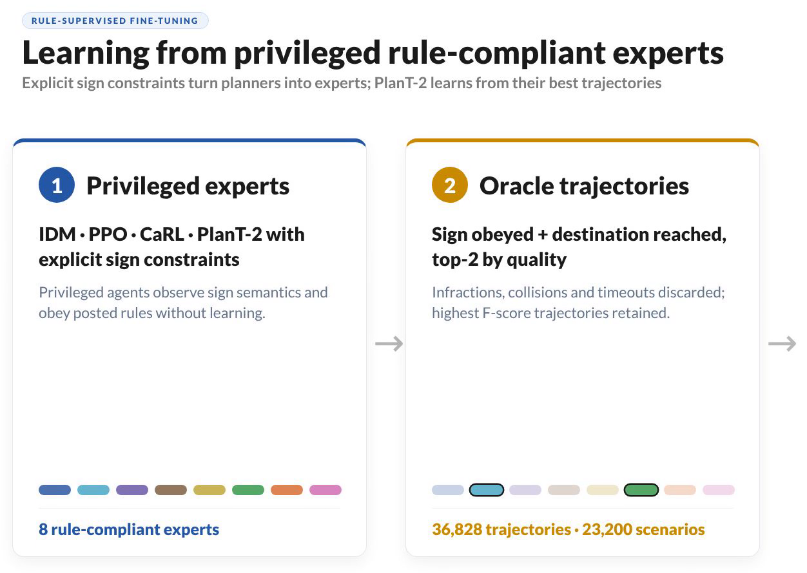
</p>

```bash
# 1 — collect expert rollouts (start with a smoke run and eyeball the GIFs)
SIGN=yield SMOKE=1 ./traffic_bench/oracle/collect/collect.sh

# 2 — filter + rank, keep the best trajectories per scene
SIGN=yield HORIZON=1500 ./traffic_bench/oracle/select/coverage.sh

# 3 — policy-vs-oracle table
SIGN=yield HORIZON=1500 ./traffic_bench/oracle/report/table.sh
```

This yields **36,828 trajectories** over 23,200 training scenarios — on average 1.6
successful demonstrations per scenario, contributed by all 8 experts rather than one
dominant policy.

From there it is two more hops: replay the picks into PlanT-2 training frames, then build a
split and train.

```bash
# 4 — oracle picks → BEV / boxes / measurements frames
python finetune/expert_replay_inenv.py \
    --experts .../experts_scene_uid_top1.jsonl \
    --scenes-root data/scenes/yield \
    --save-plant2-dir ./plant2_out

# 5 — frames → train/val split → fine-tune (see the pipeline README for the full env)
cd scripts/plant2_ft_pipeline
SPLIT_SRCS="yield=$DUMP/yield" SPLIT_OUT=$WORK/plant2_splits/yield \
  PYTHONPATH=.:$TRB_ROOT python data/make_train_val_split_fv_experts_signs.py
```

<details>
<summary><b>How the sign gets into the network</b></summary>
<br>
<p align="center">
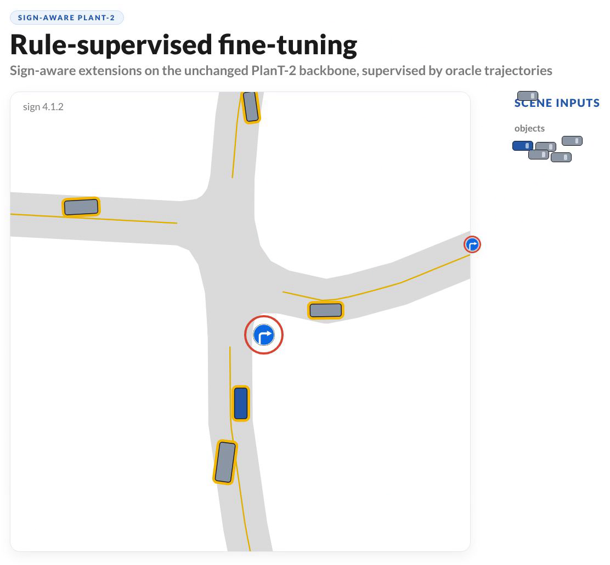
</p>

The 37.2 M-parameter backbone is unchanged. Signs arrive as object tokens with learned class
projections; a persistent sign-state token carries the active class and posted value so
zone-level restrictions survive after the plate leaves the field of view; a learnable speed
token drives a discrete ego-speed head. Total addition: 147,976 parameters (0.4%).
</details>

- **[`traffic_bench/oracle/`](traffic_bench/oracle/README.md)** — collect, select, report
- **[`traffic_bench/oracle/collect/`](traffic_bench/oracle/collect/README.md)** — multi-GPU collection, resume semantics, tuning
- **[`finetune/`](finetune/README.md)** — expert replay → PlanT-2 training frames
- **[`scripts/plant2_ft_pipeline/`](scripts/plant2_ft_pipeline/README.md)** — split → train → training curves, and two traps worth reading about: label target speed with the expert's actual speed rather than the posted plate, and pick checkpoints by closed-loop eval rather than validation loss

## Generate your own scenes

The released scenes come from Moscow, but the pipeline is city-agnostic:
`OSM → collect → assign → materialize → review → pack → publish`.

```bash
python -m traffic_bench.scene_collection collect --skip-existing   # harvest + split + crop
python -m traffic_bench.scene_collection assign                    # allocate maps to signs
python -m traffic_bench.scene_collection materialize --all         # → data/scenes/<sign>/
```

Allocation is tiered by physical place so two signs never reuse the same junction across
semantic groups, and topology quotas (T/X 50/50, straight/curved, lane count) are preserved
per sign. Details: **[`traffic_bench/scene_collection/README.md`](traffic_bench/scene_collection/README.md)**.

## Sign registry

25 scenario types ship as ready-to-run eval profiles. Use the `sign=` value with every CLI
verb — `manifest`, `run`, and `metrics` all accept it, as does `sign=all`.

<details>
<summary><b>All 25 sign IDs</b></summary>
<br>

| `sign=` | Code | Group | Family |
| --- | --- | --- | --- |
| `main_road` | 2.1 | Priority | [junction](traffic_bench/eval/signs/junction/README.md) |
| `secondary` | 2.3 | Priority | [junction](traffic_bench/eval/signs/junction/README.md) |
| `yield` | 2.4 | Priority | [junction](traffic_bench/eval/signs/junction/README.md) |
| `stop` | 2.5 | Priority | [junction](traffic_bench/eval/signs/junction/README.md) |
| `roundabout` | 4.3 | Priority | [roundabout](traffic_bench/eval/signs/roundabout/README.md) |
| `crosswalk` | 5.19 | Priority | [crosswalk](traffic_bench/eval/signs/crosswalk/README.md) |
| `speed_limit` | 3.24 | Speed | [speed](traffic_bench/eval/signs/speed/README.md) |
| `min_speed` | 4.6 | Speed | [speed](traffic_bench/eval/signs/speed/README.md) |
| `residential_zone` | 5.21 | Speed | [speed](traffic_bench/eval/signs/speed/README.md) |
| `zone_speed_limit` | 5.31 | Speed | [speed](traffic_bench/eval/signs/speed/README.md) |
| `blocked_road` | 3.2 | Obstacles | [blocked](traffic_bench/eval/signs/blocked/README.md) |
| `detour/right` | 4.2.1 | Obstacles | [detour](traffic_bench/eval/signs/detour/README.md) |
| `detour/left` | 4.2.2 | Obstacles | [detour](traffic_bench/eval/signs/detour/README.md) |
| `detour/either` | 4.2.3 | Obstacles | [detour](traffic_bench/eval/signs/detour/README.md) |
| `no_entry` | 3.1 | Routing | [dual_path](traffic_bench/eval/signs/dual_path/README.md) |
| `no_turn/right` | 3.18.1 | Routing | [dual_path](traffic_bench/eval/signs/dual_path/README.md) |
| `no_turn/left` | 3.18.2 | Routing | [dual_path](traffic_bench/eval/signs/dual_path/README.md) |
| `direction/straight` | 4.1.1 | Routing | [dual_path](traffic_bench/eval/signs/dual_path/README.md) |
| `direction/right` | 4.1.2 | Routing | [dual_path](traffic_bench/eval/signs/dual_path/README.md) |
| `direction/left` | 4.1.3 | Routing | [dual_path](traffic_bench/eval/signs/dual_path/README.md) |
| `direction/straight_right` | 4.1.4 | Routing | [dual_path](traffic_bench/eval/signs/dual_path/README.md) |
| `direction/straight_left` | 4.1.5 | Routing | [dual_path](traffic_bench/eval/signs/dual_path/README.md) |
| `direction/left_right` | 4.1.6 | Routing | [dual_path](traffic_bench/eval/signs/dual_path/README.md) |
| `one_way/right` | 5.7.1 | Routing | [dual_path](traffic_bench/eval/signs/dual_path/README.md) |
| `one_way/left` | 5.7.2 | Routing | [dual_path](traffic_bench/eval/signs/dual_path/README.md) |

The four reserved-lane scenario types from the paper (bus and bicycle lanes, signs 5.11.x
and 5.14.x) have scenes in the dataset and rule checkers in
[`traffic_bench/signs/extra/restricted_lane.py`](traffic_bench/signs/extra/restricted_lane.py),
but are not yet exposed as eval profiles.
</details>

## Repository map

```text
traffic_bench/
├── signs/              # runtime sign plates: zone, violation predicate, icon
├── envs/               # SUMO environment, traffic actors, pedestrians
├── agents/             # planners and rule-compliance overlays
├── eval/               # manifest → rollout → metrics  (the benchmark CLI)
│   ├── signs/          # per-family scenario construction and placement
│   └── configs/        # Hydra: config.yaml, run.yaml, sign/, shared/
├── oracle/             # expert collection, oracle selection, reports
└── scene_collection/   # OSM harvesting → crops → official scenes
finetune/               # oracle replay → PlanT-2 training frames
scripts/                # PlanT-2 fine-tuning pipeline: split → train → curves
tools/                  # progress dashboards and one-off debug helpers
third_party/            # MetaDrive, PlanT-2, CaRL (submodules)
assets/                 # figures and rollouts used by this README
data/                   # downloaded scenes and generated runs  (gitignored)
checkpoints/            # planner weights                       (gitignored)
```

Per-component documentation:

| Area | Read |
| --- | --- |
| Benchmark CLI, splits, parallel eval, metrics | [`eval/`](traffic_bench/eval/README.md) · [`eval/metrics/`](traffic_bench/eval/metrics/README.md) |
| Scenario construction per sign family | [`eval/signs/`](traffic_bench/eval/signs/README.md) |
| Sign plates and rule predicates | [`signs/`](traffic_bench/signs/README.md) |
| Simulation environment | [`envs/`](traffic_bench/envs/README.md) |
| Planners and overlays | [`agents/`](traffic_bench/agents/README.md) |
| Expert rollouts and oracle selection | [`oracle/`](traffic_bench/oracle/README.md) |
| Scene generation from OSM | [`scene_collection/`](traffic_bench/scene_collection/README.md) |
| PlanT-2 fine-tuning | [`finetune/`](finetune/README.md) · [`scripts/plant2_ft_pipeline/`](scripts/plant2_ft_pipeline/README.md) |
| Debug helpers | [`tools/`](tools/README.md) |

## Citation

```bibtex
@misc{trafficsignbench2026,
  title        = {TrafficSignBench: Evaluating Traffic Rule Compliance in Autonomous Driving},
  author       = {{EMB AI}},
  year         = {2026},
  howpublished = {\url{https://github.com/emb-ai/traffic-sign-bench}},
  note         = {Code, scenes, and models}
}
```

## Acknowledgements

Built on [MetaDrive](https://github.com/metadriverse/metadrive) and
[SUMO](https://eclipse.dev/sumo/), with planners from
[CaRL](https://github.com/autonomousvision/CaRL) and
[PlanT-2](https://github.com/emb-ai/plant2). Maps come from
[OpenStreetMap](https://www.openstreetmap.org/) contributors; scenario distributions are
calibrated on [nuPlan](https://www.nuscenes.org/nuplan). Published weights are released
under CC BY 4.0.

<div align="center">
<br>
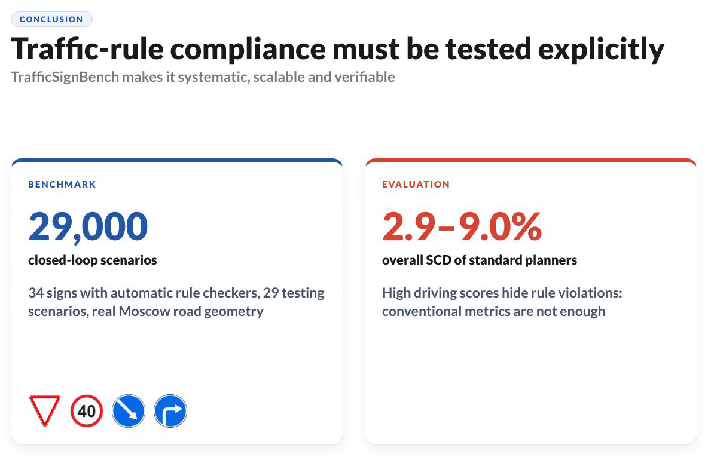
<br><br>
<b>Found a sign we should add, or a planner we should break?</b><br>
<sub><a href="https://github.com/emb-ai/traffic-sign-bench/issues">Open an issue</a> — and a ⭐ helps others find the benchmark.</sub>
</div>
