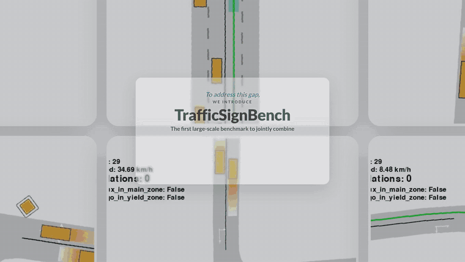

<p align="center">
  
</p>

<div align="center">

<h1>
  
  TrafficSignBench
</h1>

Rule-Centric Closed-Loop Evaluation of Traffic-Sign Compliance in Autonomous Driving


</div>

<h2>
  
  News
</h2>

- **[2025]** Our paper is now available on arXiv! Check out the [video demo](https://emb-ai.github.io/traffic-sign-bench/).


## Key result

Across the released held-out split, standard planners achieve only **2.9–9.0%
overall SCD**. Rule-supervised fine-tuning raises PlanT-2 from **5.9% to 72.3%**
without replacing its backbone.


| Planner        | Driving Score ↑ | Destination ↑ | Collision ↓ | Overall SCD ↑ |
| -------------- | --------------- | ------------- | ----------- | ------------- |
| IDM            | 35.7            | 66.4%         | 21.0%       | 7.2%          |
| PPO            | 35.6            | 67.9%         | 27.5%       | 3.2%          |
| CaRL           | 39.6            | 73.7%         | 21.0%       | 2.9%          |
| PlanT-2        | 28.6            | 56.1%         | 43.3%       | 5.9%          |
| **PlanT-2-FT** | **74.2**        | **74.8%**     | **12.0%**   | **72.3%**     |


Held-out test split, 5,800 episodes. Conventional metrics are episode-weighted; SCD is macro-averaged over scenario types. Privileged policies that read the target rule directly are upper references and are not included in this baseline table.

Two observations motivate the benchmark:

1. **Standard driving metrics are not compliance proxies.** A planner can improve
  route completion without learning the active rule.
2. **The fine-tuning gain is sign-conditioned.** Removing sign identity from the
  same checkpoint drops SCD from 72.8% to 15.4%.

See the [video demonstrations](https://emb-ai.github.io/traffic-sign-bench/) for
matched baseline and rule-compliant rollouts on the same scenes and routes.

## Benchmark at a glance

The 34 implemented signs cover four capabilities:


| Group         | What it tests                                              | Examples                                        |
| ------------- | ---------------------------------------------------------- | ----------------------------------------------- |
| **Priority**  | Right-of-way with conflicting vehicles and pedestrians     | yield, stop, roundabout, crosswalk              |
| **Speed**     | Longitudinal control under local and zone-wide constraints | maximum, minimum, residential and zone limits   |
| **Obstacles** | Safe navigation around inaccessible space                  | blocked roads and mandatory passing sides       |
| **Routing**   | Re-planning under prohibited segments and manoeuvres       | no entry, no turn, mandatory direction, one-way |


Each map is expanded across route, spawn, speed, traffic-density, and actor-dynamics
variations calibrated from nuPlan. Maps are split by OSM identity before scenario
generation, so the same street cannot appear in both training and test sets.

For the complete sign registry and family-specific construction logic, see
`[traffic_bench/eval/signs/](traffic_bench/eval/signs/README.md)`.

## Quick start

This smoke test runs one CPU-only IDM episode on a yield-sign scene. It requires no
GPU and no model checkpoint.

### Requirements

- Linux
- Git with submodule support
- Python 3.10 (recommended)
- Conda or another isolated Python environment


### 1. Clone and install

```bash
git clone --recurse-submodules https://github.com/emb-ai/traffic-sign-bench.git
cd traffic-sign-bench

conda create -n trafficsignbench python=3.10 -y
conda activate trafficsignbench

# Patched simulator with traffic-sign objects and rule zones
pip install -e third_party/metadrive

# Benchmark package and runtime dependencies
pip install -e .
pip install eclipse-sumo sumolib hydra-core scipy pandas \
  stable-baselines3 pyproj "geopandas<1.0" timm huggingface_hub
```

If the repository was cloned without submodules:

```bash
git submodule update --init --recursive
```


### 2. Download a small scene subset

```bash
hf download emb-ai/traffic-sign-bench \
  --repo-type dataset \
  --include "scenes/yield/**" \
  --local-dir data
```

Remove `--include "scenes/yield/**"` to download the complete benchmark.
Downloaded scenes are placed under `data/scenes/<sign>/`.

### 3. Build a manifest and run

```bash
# Create one reproducible debug scenario.
python -m traffic_bench.eval manifest \
  sign=yield \
  scenario.max_total=1

# Run closed-loop evaluation with online rule checking.
python -m traffic_bench.eval run \
  policy=idm \
  sign=yield \
  jobs=1 \
  gif.enabled=false
```

Outputs are written to:

```text
data/runs/yield/debug/<timestamp>/
├── real_manifest.jsonl
├── config.yaml
└── eval_out/              # episode records, metrics, and report
```

To render a debug GIF, rerun with `gif.enabled=true`. Headless rendering requires
an offscreen OpenGL context; evaluation itself does not.

**Common setup problems**


| Symptom                                | Fix                                                                                            |
| -------------------------------------- | ---------------------------------------------------------------------------------------------- |
| `third_party/metadrive` is empty       | Run `git submodule update --init --recursive`.                                                 |
| `SUMO_HOME` or `netconvert` is missing | Activate the environment where `eclipse-sumo` was installed and verify `netconvert --version`. |
| `hf: command not found`                | Upgrade with `pip install -U huggingface_hub`; older releases use `huggingface-cli download`.  |
| ALSA warnings on a headless machine    | They are harmless; use `SDL_AUDIODRIVER=dummy` if needed.                                      |
| GIF rendering fails                    | Keep `gif.enabled=false` or configure offscreen OpenGL/EGL for Panda3D.                        |


For every CLI option, split semantics, augmentation controls, and recovery
instructions, read the **[evaluation guide](traffic_bench/eval/README.md)**.

## Full evaluation

Evaluation has three explicit stages:

```bash
# 1. Freeze a test manifest (one sign per invocation).
python -m traffic_bench.eval manifest sign=yield paths.split=test

# 2. Evaluate one or more planners.
python -m traffic_bench.eval run \
  "policies=[idm,idm_rule]" \
  sign=yield

# 3. Aggregate completed runs.
python -m traffic_bench.eval metrics combine sign=all
```

- `sign=all` covers all registered evaluation profiles.
- Nested IDs use Hydra paths such as `sign=direction/right`.
- `policy=<name>` runs one planner; `policies=[...]` runs several;
`policies=all` runs the complete registry.
- `debug` creates timestamped disposable manifests. `train` and `test` are stable,
immutable snapshots.

For multi-GPU evaluation:

```bash
SPLIT=test CPU_WORKERS=4 GPUS=0,1,2,3 JOBS=16 JOBS_NN=16 \
  bash traffic_bench/eval/run/run_signs_parallel.sh

python tools/eval_progress.py --watch 30
```

> Parallel CPU evaluation uses spawned process pools. After interrupting a run,
> follow the orphan-worker cleanup procedure in the
> [evaluation guide](traffic_bench/eval/README.md#3-parallel-multi-sign-eval-recommended-on-multi-gpu).


## Planners and checkpoints


| `policy=`                | Planner       | Rule access        | Checkpoint            |
| ------------------------ | ------------- | ------------------ | --------------------- |
| `idm`                    | CurveAwareIDM | none               | not required          |
| `idm_rule`               | CurveAwareIDM | explicit           | not required          |
| `ppo_lidar`              | PPO           | none               | bundled configuration |
| `ppo_rule`               | PPO           | explicit           | bundled configuration |
| `carl` / `carl_rule`     | CaRL          | none / explicit    | downloaded            |
| `plant2` / `plant2_rule` | PlanT-2       | none / explicit    | downloaded            |
| `plant2_ft`              | PlanT-2-FT    | learned from signs | downloaded            |


Download all published weights:

```bash
hf download emb-ai/traffic-rule-bench-models --local-dir checkpoints
```

Privileged `*_rule` planners read the active rule directly. They are useful as
oracle experts and upper references, but they are not deployable baselines.
The CPU-only IDM smoke test uses the base environment above; neural planners may
also require their upstream
[CaRL](https://github.com/autonomousvision/CaRL) or
[PlanT-2](https://github.com/emb-ai/plant2) environment.

## Training and data pipelines

The top-level README intentionally keeps advanced workflows short. Their dedicated
guides contain the required environments, commands, path conventions, and failure
modes:

- **Evaluate planners:** `[traffic_bench/eval/README.md](traffic_bench/eval/README.md)`
- **Understand rule checkers:** `[traffic_bench/signs/README.md](traffic_bench/signs/README.md)`
- **Inspect scenario families:** `[traffic_bench/eval/signs/README.md](traffic_bench/eval/signs/README.md)`
- **Generate scenes from OSM:** `[traffic_bench/scene_collection/README.md](traffic_bench/scene_collection/README.md)`
- **Collect and select oracle experts:** `[traffic_bench/oracle/README.md](traffic_bench/oracle/README.md)`
- **Replay experts into PlanT-2 frames:** `[finetune/README.md](finetune/README.md)`
- **Fine-tune PlanT-2:** `[scripts/plant2_ft_pipeline/README.md](scripts/plant2_ft_pipeline/README.md)`
- **Run metrics and plots:** `[traffic_bench/eval/metrics/README.md](traffic_bench/eval/metrics/README.md)`


## Repository structure

```text
traffic_bench/
├── signs/               # sign plates, active zones, violation predicates
├── envs/                # SUMO/MetaDrive environment and traffic actors
├── agents/              # planners and rule-aware wrappers
├── eval/                # manifest → rollout → metrics
├── oracle/              # expert collection, selection, and reports
└── scene_collection/    # OSM harvesting and scenario materialization
finetune/                # expert replay → PlanT-2 training frames
scripts/plant2_ft_pipeline/
                         # dataset split, training, and analysis
tools/                   # progress and debugging utilities
third_party/             # MetaDrive, PlanT-2, and CaRL submodules
data/                    # downloaded scenes and generated runs (gitignored)
checkpoints/             # downloaded planner weights (gitignored)
```


## Citation

If TrafficSignBench is useful in your research, please cite:

```bibtex
@misc{trafficsignbench2026,
  title        = {TrafficSignBench: Evaluating Traffic Rule Compliance in Autonomous Driving},
  year         = {2026},
  publisher = {\url{https://github.com/emb-ai/traffic-sign-bench}},
}
```


## Acknowledgements

TrafficSignBench builds on  
[MetaDrive](https://github.com/metadriverse/metadrive),  
[SUMO](https://eclipse.dev/sumo/),  
[CaRL](https://github.com/autonomousvision/CaRL), and  
[PlanT-2](https://github.com/emb-ai/plant2). Maps are derived from  
[OpenStreetMap](https://www.openstreetmap.org/) contributors, and scenario  
distributions are calibrated with [nuPlan](https://www.nuscenes.org/nuplan).