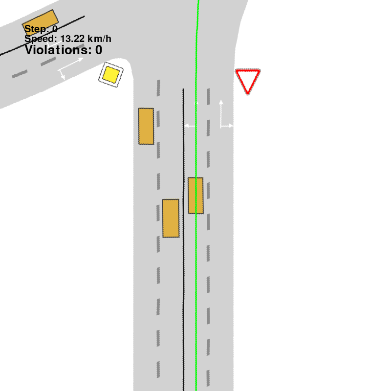
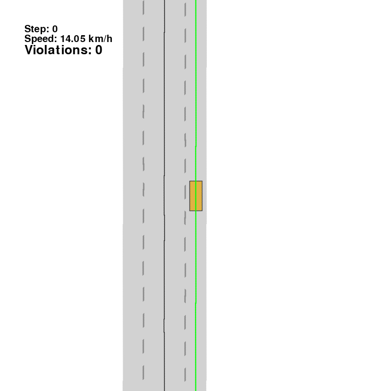
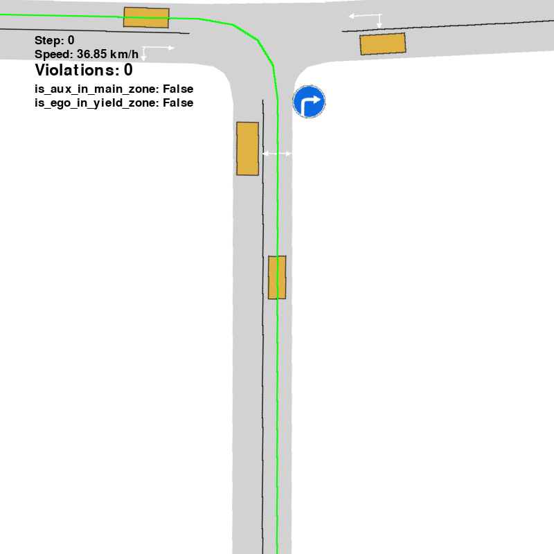
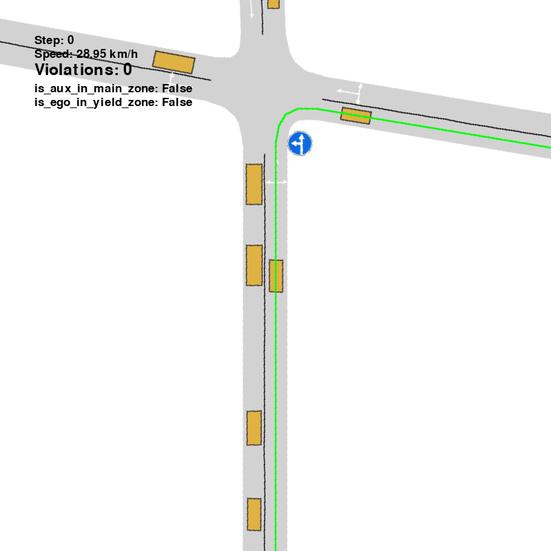
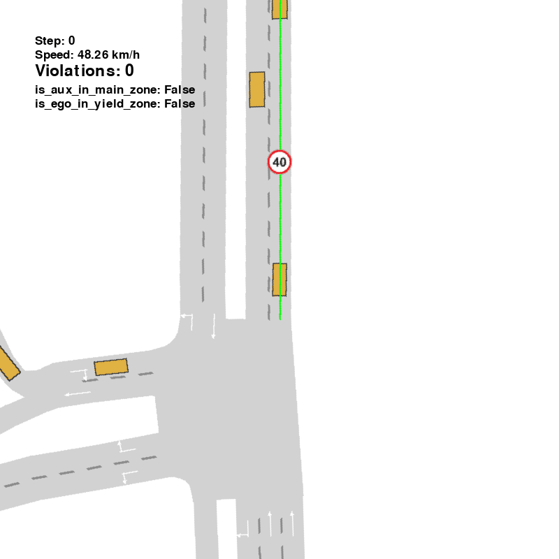

<p align="center">
  
</p>

<div align="center">

<h1>
  
  
  
  &nbsp;TrafficSignBench&nbsp;
  
  
  
</h1>

Rule-Centric Closed-Loop Evaluation of Traffic-Sign Compliance in Autonomous Driving

[](https://emb-ai.github.io/traffic-sign-bench/)
[](https://emb-ai.github.io/traffic-sign-bench/)
[](https://huggingface.co/datasets/emb-ai/traffic-sign-bench)
[](https://huggingface.co/emb-ai/traffic-rule-bench-models)

</div>


##  News

- **[2026]** Our paper is now available on arXiv! Check out the [video demo](https://emb-ai.github.io/traffic-sign-bench/).
- **[2026-09-28]** TrafficSignBench code is out! Run the Quick start test below, or evaluate your own planner on the [released scenes](https://huggingface.co/datasets/emb-ai/traffic-sign-bench) and [checkpoints](https://huggingface.co/emb-ai/traffic-rule-bench-models).


<br>

##  Key Results

On the held-out split, current planners achieve only **2.9–9.0% SCD**
(Sign-Compliant Destination: obey the sign *and* reach the goal).
High driving scores do not imply rule compliance.

<p align="center">
  
  
  <br/>
  <em>CaRL, PlanT-2, and PPO still break yield, crosswalk, and mandatory-direction rules.</em>
</p>

<br/>

Rule-supervised fine-tuning raises PlanT-2 from **5.9% to 72.3%** without replacing its backbone.

<p align="center">
  
  
  &nbsp;&nbsp;&nbsp;&nbsp;
  
  <br/>
  <em>
    
    PlanT-2 takes the prohibited branch; PlanT-2-FT reroutes.<br/>
    
    PlanT-2 ignores the speed limit; PlanT-2-FT slows down.
  </em>
</p>

<br/>

| Planner        | Driving Score ↑ | Destination ↑ | Collision ↓ | SCD ↑     |
| -------------- | --------------- | ------------- | ----------- | --------- |
| IDM            | 35.7            | 66.4%         | 21.0%       | 7.2%      |
| PPO            | 35.6            | 67.9%         | 27.5%       | 3.2%      |
| CaRL           | 39.6            | 73.7%         | 21.0%       | 2.9%      |
| PlanT-2        | 28.6            | 56.1%         | 43.3%       | 5.9%      |
| **PlanT-2-FT** | **74.2**        | **74.8%**     | **12.0%**   | **72.3%** |


Held-out test split, 5,800 episodes. Conventional metrics are episode-weighted; SCD is macro-averaged over scenario types. Privileged policies that read the target rule directly are upper references and are not included in this baseline table (you can find them in the paper).


<br/>


##  Quick start

This smoke test runs one CPU-only IDM episode on a yield-sign scene. It requires no
GPU and no model checkpoint.

### 1. Clone and install

```bash
git clone --recurse-submodules https://github.com/emb-ai/traffic-sign-bench.git
cd traffic-sign-bench

conda create -n trafficsignbench python=3.10 -y
conda activate trafficsignbench

# Patched simulator with traffic-sign objects and rule zones
pip install -e third_party/metadrive

# Benchmark package and runtime dependencies
pip install -e .
pip install eclipse-sumo sumolib hydra-core scipy pandas \
  stable-baselines3 pyproj "geopandas<1.0" timm huggingface_hub
```

If the repository was cloned without submodules:

```bash
git submodule update --init --recursive
```


### 2. Download a small scene subset

```bash
hf download emb-ai/traffic-sign-bench \
  --repo-type dataset \
  --include "scenes/yield/**" \
  --local-dir data
```

Remove `--include "scenes/yield/**"` to download the complete benchmark.
Downloaded scenes are placed under `data/scenes/<sign>/`.

### 3. Build a manifest and run

```bash
# Create one reproducible debug scenario.
python -m traffic_bench.eval manifest \
  sign=yield \
  scenario.max_total=1

# Run closed-loop evaluation with online rule checking.
python -m traffic_bench.eval run \
  policy=idm \
  sign=yield \
  jobs=1 \
  gif.enabled=false
```

Outputs are written to:

```text
data/runs/yield/debug/<timestamp>/
├── real_manifest.jsonl
├── config.yaml
└── eval_out/              # episode records, metrics, and report
```

To render a debug GIF, rerun with `gif.enabled=true`. Headless rendering requires
an offscreen OpenGL context; evaluation itself does not.

For every CLI option, split semantics, augmentation controls, and recovery
instructions, read the **[evaluation guide](traffic_bench/eval/README.md)**.

<br/>


##  Full evaluation

Evaluation has three explicit stages:

```bash
# 1. Freeze a test manifest (one sign per invocation).
python -m traffic_bench.eval manifest sign=yield paths.split=test

# 2. Evaluate one or more planners.
python -m traffic_bench.eval run \
  "policies=[idm,idm_rule]" \
  sign=yield

# 3. Aggregate completed runs.
python -m traffic_bench.eval metrics combine sign=all
```

- `sign=all` covers all registered evaluation profiles.
- Nested IDs use Hydra paths such as `sign=direction/right`.
- `policy=<name>` runs one planner; `policies=[...]` runs several;
`policies=all` runs the complete registry.
- `debug` creates timestamped disposable manifests. `train` and `test` are stable,
immutable snapshots.

For multi-GPU evaluation:

```bash
SPLIT=test CPU_WORKERS=4 GPUS=0,1,2,3 JOBS=16 JOBS_NN=16 \
  bash traffic_bench/eval/run/run_signs_parallel.sh

python tools/eval_progress.py --watch 30
```

> Parallel CPU evaluation uses spawned process pools. After interrupting a run,
> follow the orphan-worker cleanup procedure in the
> [evaluation guide](traffic_bench/eval/README.md#3-parallel-multi-sign-eval-recommended-on-multi-gpu).


<br/>

##  Planners and checkpoints


| `policy=`                | Planner       | Rule access        | Checkpoint            |
| ------------------------ | ------------- | ------------------ | --------------------- |
| `idm` / `idm_rule`       | CurveAwareIDM | none / explicit    | not required          |
| `ppo_lidar` / `ppo_rule` | PPO           | none / explicit    | bundled configuration |
| `carl` / `carl_rule`     | CaRL          | none / explicit    | downloaded            |
| `plant2` / `plant2_rule` | PlanT-2       | none / explicit    | downloaded            |
| `plant2_ft`              | PlanT-2-FT    | learned from signs | downloaded            |


Download all published weights:

```bash
hf download emb-ai/traffic-rule-bench-models --local-dir checkpoints
```

Privileged `*_rule` planners read the active rule directly. They are useful as
oracle experts and upper references.

<br/>

##  Sign registry

25 scenario types ship as ready-to-run eval profiles. Use the `sign=` value with every CLI
verb — `manifest`, `run`, and `metrics` all accept it, as does `sign=all`.

<details>
<summary><b>All 25 sign IDs</b></summary>

| `sign=`                    | Code   | Group     | Family                                                      |
| -------------------------- | ------ | --------- | ----------------------------------------------------------- |
| `main_road`                | 2.1    | Priority  | [junction](traffic_bench/eval/signs/junction/README.md)     |
| `secondary`                | 2.3    | Priority  | [junction](traffic_bench/eval/signs/junction/README.md)     |
| `yield`                    | 2.4    | Priority  | [junction](traffic_bench/eval/signs/junction/README.md)     |
| `stop`                     | 2.5    | Priority  | [junction](traffic_bench/eval/signs/junction/README.md)     |
| `roundabout`               | 4.3    | Priority  | [roundabout](traffic_bench/eval/signs/roundabout/README.md) |
| `crosswalk`                | 5.19   | Priority  | [crosswalk](traffic_bench/eval/signs/crosswalk/README.md)   |
| `speed_limit`              | 3.24   | Speed     | [speed](traffic_bench/eval/signs/speed/README.md)           |
| `min_speed`                | 4.6    | Speed     | [speed](traffic_bench/eval/signs/speed/README.md)           |
| `residential_zone`         | 5.21   | Speed     | [speed](traffic_bench/eval/signs/speed/README.md)           |
| `zone_speed_limit`         | 5.31   | Speed     | [speed](traffic_bench/eval/signs/speed/README.md)           |
| `blocked_road`             | 3.2    | Obstacles | [blocked](traffic_bench/eval/signs/blocked/README.md)       |
| `detour/right`             | 4.2.1  | Obstacles | [detour](traffic_bench/eval/signs/detour/README.md)         |
| `detour/left`              | 4.2.2  | Obstacles | [detour](traffic_bench/eval/signs/detour/README.md)         |
| `detour/either`            | 4.2.3  | Obstacles | [detour](traffic_bench/eval/signs/detour/README.md)         |
| `no_entry`                 | 3.1    | Routing   | [dual_path](traffic_bench/eval/signs/dual_path/README.md)   |
| `no_turn/right`            | 3.18.1 | Routing   | [dual_path](traffic_bench/eval/signs/dual_path/README.md)   |
| `no_turn/left`             | 3.18.2 | Routing   | [dual_path](traffic_bench/eval/signs/dual_path/README.md)   |
| `direction/straight`       | 4.1.1  | Routing   | [dual_path](traffic_bench/eval/signs/dual_path/README.md)   |
| `direction/right`          | 4.1.2  | Routing   | [dual_path](traffic_bench/eval/signs/dual_path/README.md)   |
| `direction/left`           | 4.1.3  | Routing   | [dual_path](traffic_bench/eval/signs/dual_path/README.md)   |
| `direction/straight_right` | 4.1.4  | Routing   | [dual_path](traffic_bench/eval/signs/dual_path/README.md)   |
| `direction/straight_left`  | 4.1.5  | Routing   | [dual_path](traffic_bench/eval/signs/dual_path/README.md)   |
| `direction/left_right`     | 4.1.6  | Routing   | [dual_path](traffic_bench/eval/signs/dual_path/README.md)   |
| `one_way/right`            | 5.7.1  | Routing   | [dual_path](traffic_bench/eval/signs/dual_path/README.md)   |
| `one_way/left`             | 5.7.2  | Routing   | [dual_path](traffic_bench/eval/signs/dual_path/README.md)   |

</details>


<br/>

##  Repository map

```text
traffic_bench/
├── signs/               # sign plates, active zones, violation predicates
├── envs/                # SUMO/MetaDrive environment and traffic actors
├── agents/              # planners and rule-aware wrappers
├── eval/                # manifest → trajectory → metrics
├── oracle/              # expert collection, selection, and reports
└── scene_collection/    # OSM harvesting and scenario materialization
finetune/                # expert replay → PlanT-2 training frames
scripts/plant2_ft_pipeline/
                         # dataset split, training, and analysis
tools/                   # progress and debugging utilities
third_party/             # MetaDrive, PlanT-2, and CaRL submodules
data/                    # downloaded scenes and generated runs (gitignored)
checkpoints/             # downloaded planner weights (gitignored)
```


<br/>

##  Citation

If TrafficSignBench is useful in your research, please cite:

```bibtex
@misc{trafficsignbench2026,
  title     = {TrafficSignBench: Evaluating Traffic Rule Compliance in Autonomous Driving},
  year      = {2026},
  publisher = {\url{https://github.com/emb-ai/traffic-sign-bench}},
  note      = {Code, scenes, and models}
}
```


<br/>

##  Acknowledgements

Built on [MetaDrive](https://github.com/metadriverse/metadrive) and
[SUMO](https://eclipse.dev/sumo/), with planners from
[CaRL](https://github.com/autonomousvision/CaRL) and
[PlanT-2](https://github.com/emb-ai/plant2). Maps come from
[OpenStreetMap](https://www.openstreetmap.org/) contributors; scenario distributions are
calibrated on [nuPlan](https://www.nuscenes.org/nuplan). 